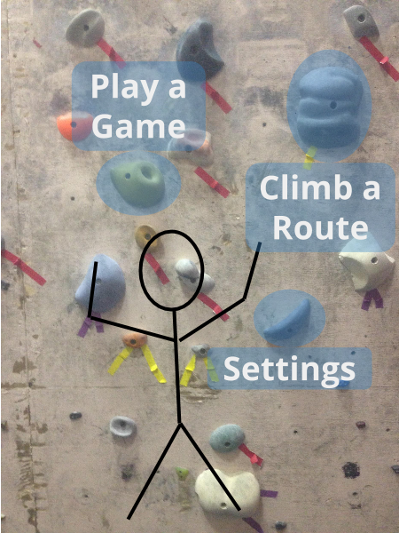
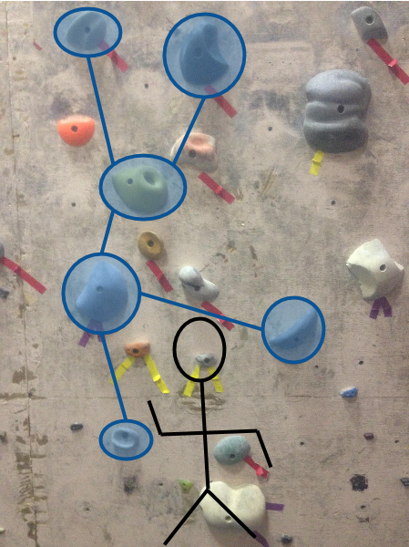
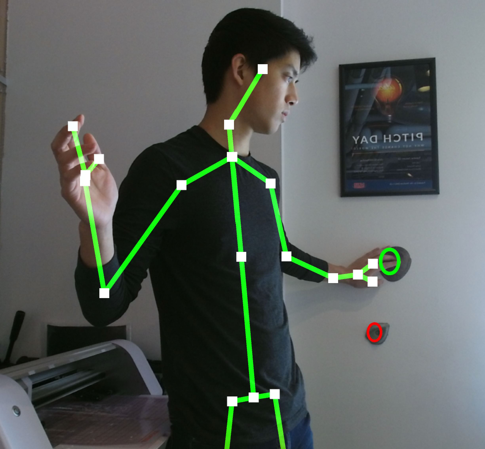
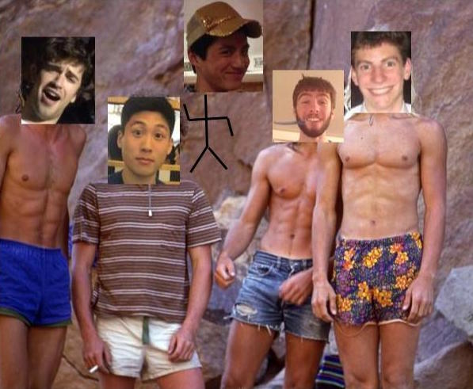

# climb.AR
Orestis Lykouropoulos, Charley Ren, Pat Xu, David Bain, Jon Kramer

- [Overview](https://github.com/patxu/cs98-senior-project#overview)
- [Mockups](https://github.com/patxu/cs98-senior-project#game-mockups)
- [Unity Scene](https://github.com/patxu/cs98-senior-project#unity-scene)
- [Architecture](https://github.com/patxu/cs98-senior-project#architecture)
- [Setup](https://github.com/patxu/cs98-senior-project#setup)
- [Deployment](https://github.com/patxu/cs98-senior-project#deployment)
- [Docs](https://github.com/patxu/cs98-senior-project#docs)
- [The Team](https://github.com/patxu/cs98-senior-project#the-team)
- [Acknowledgements](https://github.com/patxu/cs98-senior-project#acknowledgements)

## Overview
We are building an augmented reality climbing game platform, with a focus on releasing the platform as a developer-friendly development kit. Components include
- wall, hold, and climber body recognition via [OpenCV](http://opencv.org/),
- hold grabbing detection via [Microsoft Kinect](https://developer.microsoft.com/en-us/windows/kinect)

to allow developers to build 2D, interactive climbing games via Unity (e.g. these are some games that inspired our work [1](https://www.youtube.com/watch?v=W0ErnsIVzkc), [2](https://www.youtube.com/watch?v=kg2uRGf_04g), [3](http://augmentedclimbing.com/games/)).

<caption>This is an example of what our project can do. David is activating and deactivating holds, each of which have an associated music track</caption>

## Game Mockups
Some basic mockups for how we envision the project. See a simple game UI displayed on the wall. Then, grab a hold to select an option.

## The Unity Project
The Unity scene so far! It displays a circle around each climbing hold, given by the OpenCV classifier. Read about our Unity architecture to get an idea of how we use OpenCV in Unity.

<caption>This is what the Kinect "sees". We take this, run some transformations, and then display it on the actual wall/person via a projector.</caption>

## Architecture
- Unity – connecting OpenCV and Kinect
  - following [this guide](http://dogfeatherdesign.com/opencv-3-0-microsoft-visual-studio-2015-cmake-and-c/), we build OpenCV via CMake as a dll (Dynamically-Linked Library) for Windows
  - we write a C++ wrapper that imports OpenCV
  - we build and export this wrapper as a dll
  - a Unity C# script imports the dll so now we can now use OpenCV! (there is an OpenCV asset on the Unity asset store, but it costs $95 so we opted to write our own wrapper)
  - use the Kinect SDK to access live color images, skeleton, etc. – we give this data to OpenCV to do real-time classification
- Hold Recognition Classifier
  - start with ~500 positive & negative images focusing on climbing holds and train an OpenCV custom object detection classifier (Haar classifier) to detect climbing holds
    - we have to define a bounding box for our custom object in each of our images. this took a while until David smartened up and chose to make the bounding box the entire image by making each image a close-up of the climbing hold.
    - we store all of our images on a [Google Drive](https://drive.google.com/drive/folders/0B2FwMr5goxlja1JJWW1TZlhCM2s?usp=sharing)
- Kinect
  - using the official [Microsoft Kinect SDK](https://www.microsoft.com/en-us/download/details.aspx?id=44561) to get live color images (for OpenCV) and body skeleton (e.g. for a game). may also use it for depth/infrared map, etc.

## Setup
- Windows only, currently
- follow the guide above to build OpenCV
  - find our Visual Studio project for the OpenCV wrapper in `OpenCVUnity`
- download [Unity](https://unity3d.com/get-unity/download) and the Kinect SDK
  - find the Unity project in `climbARUnity`

### Hold Recognition Classifier
If you want to actually train your own classifier, here's what we did – YMMV.
- Image Pre-Processing in Java: Simple Java class - run from terminal or IDE
  - `javaImageProcessing`
- OpenCV Python
  - Install with Homebrew
    - `brew tap homebrew/science`
    - `brew install opencv3`

  - Set system paths
    - `export DYLD_FALLBACK_LIBRARY_PATH=/usr/local/Cellar/opencv3/3.1.0_1/lib:$DYLD_FALLBACK_LIBRARY_PATH`
    - `export PYTHONPATH=/usr/local/Cellar/opencv3/3.1.0_3/lib/python2.7/site-packages:$PYTHONPATH`
      - if this doesn't work then your opencv version might be slightly different. search around for the directory and it should work
    - `export PATH=/usr/local/Cellar/opencv3/3.1.0_3/bin:$PATH`
    - check by opening up `python` on cmd line and then trying to import – `import cv2`

  - Training
    - followed [this tutorial](
  http://docs.opencv.org/trunk/dc/d88/tutorial_traincascade.html)
    - `opencv_createsamples --vec classifier/position_single -info info.dat -bg bg.dat`
      - use the `-img` and `-num` flag to train off one image. this is what we did when only had 7 images and had to generate training images from a single image
    - `opencv_createsamples -vec classifier/position_single -info info.dat -bg bg.dat`
    - `opencv_traincascade -data train_cascade/ -vec classifier/position_single -bg bg.dat -numPos 50 -numNeg 3`

## Deployment
- hook up to a projector and run the Unity project!
- the setup scenes will check if the Kinect is connected and will also run some alignment preprocessing on the Kinect image

## Docs
- [Project Proposal](https://docs.google.com/document/d/1-N9_9W50bxWwFv98lRIs-yA9pZ39pB0hi-4nF0_e69U/edit?usp=sharing)
- [User Personas](https://docs.google.com/document/d/1pRK2dLdDFMOfifJBphd1jmsjdPxHTu6pCOvMk0Kpzp8/edit?usp=sharing)
- [Mockups and Data Model](https://docs.google.com/document/d/1wIeR-_1b2lWhGa01Qd_FU361YMmZCi3dA5iZgJWjieM/edit?usp=sharing)

## The Team
Who made this wonderful, open-source piece of art? Look no further.

Left to Right: Orestis, Charley, Pat, David, Jon

## Acknowledgements
  - ### Tim Tregubov
    For his technical insight, mentorship, and humor.

    

  - ### DALI Lab
    For providing a inspiring and collaborative space (Sudikoff 007), as well as crucial hardware (Macbook Pros, Kinect & projector, Windows PCs).
