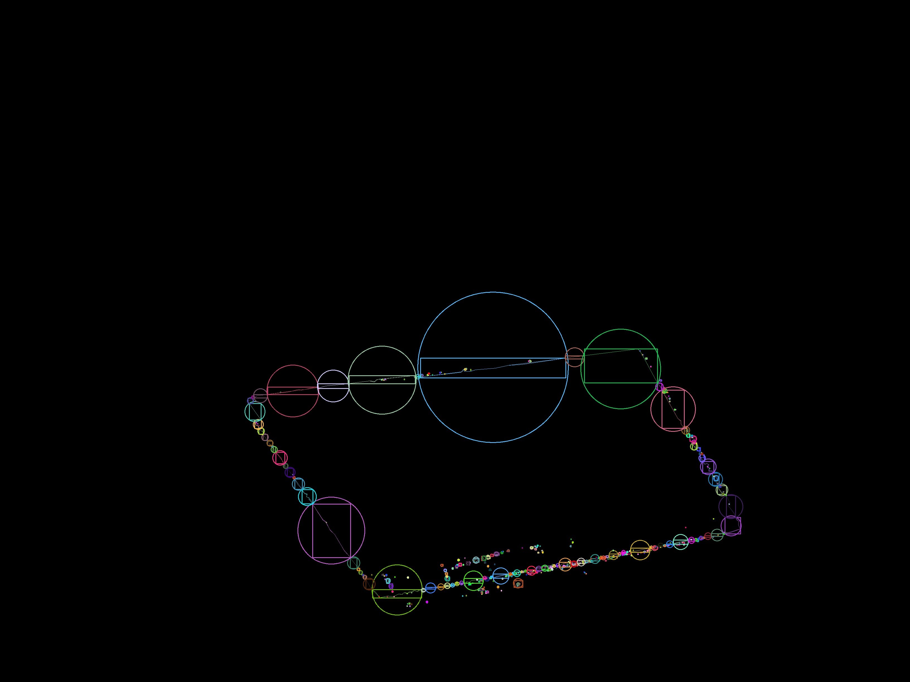

# Towards A Testable Prototype

With only one week left before demo day, here's what we have and what needs to be done.

## OpenCV
Since we had to write an OpenCV wrapper in C++ and then build it as a dll and pass it to Unity, we wrote functions to
- run our classifier against a passed-in image, getting bounding boxes for the climbing holds
- do some image analysis, ultimately getting us a bounding box for projector. this was important because the image the Kinect sees of the project is skewed

## Kinect
We access the Kinect in Unity. We had to access the raw color image as well as the skeleton data.

## Unity
This was the most complex part and brought all of our pieces together. I'll break down what we did by scene:

### KinectCheck
- tests whether the Kinect is connected

### ProjectorKinectSync
- a resizable box to allow the user to define the climbing area
- display a red, green, and blue image to allow us to get the climbing area. we use these three images and some OpenCV magic to get an outline of the quadrilateral defined by the projected image, from the perspective of the Kinect

Here's one of the images we got along the way which reflects one of our preprocessing attempts on the image. We tried finding the contours of the image, but ultimately OpenCV picked up on too many of the minute details. Nonetheless, still pretty!

### Game
- gets a frame from the Kinect and sends it over to OpenCV
- displays the bounding boxes as ellipses
- shows also the Kinect color image and skeleton with bounding boxes overlaid (WIP)

## What's Left
Overall, we're pretty impressed with how many pieces of the project we have together. We need to connect a few of the remaining components, like having the skeleton and bounding boxes in the space. Once we have the skeleton and climbing holds in the space space, we can use colliders to detect **climbing hold grab detection**. After this, we'll have all the basic components for making a game!
