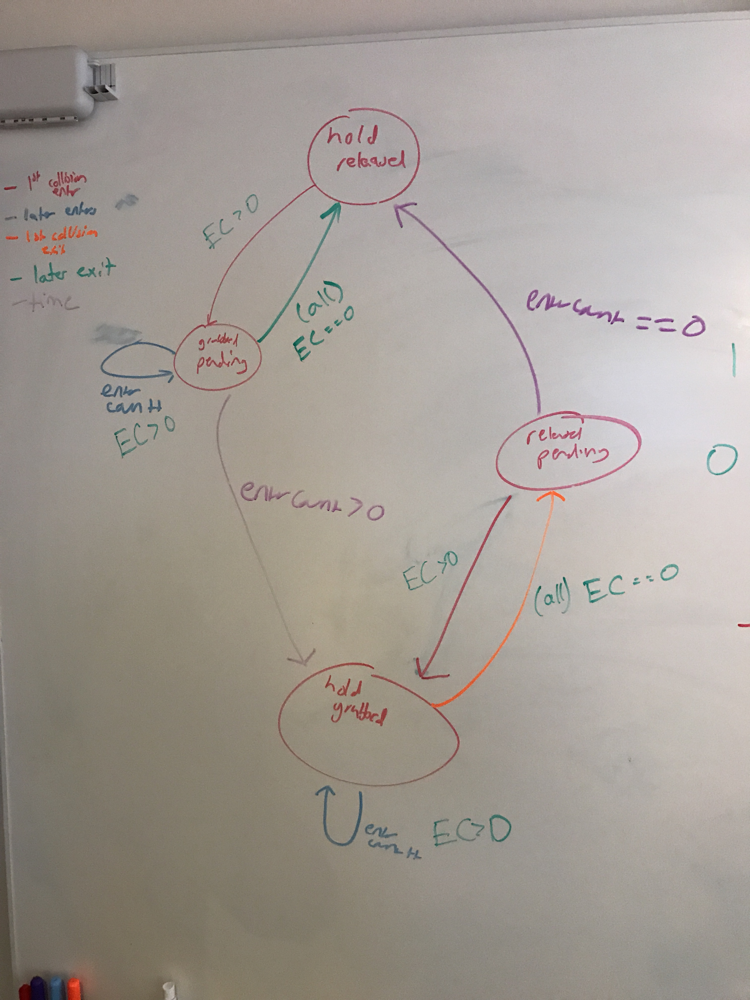

# climbAR Unity Project

## Overview
Here lies the bulk of our work. We incorporate our OpenCV hand hold detector and Microsoft Kinect into a Unity game. We also make it easily extensible for future work.

This is what our game looks like from the perspective of the Kinect. We take this, run some transformations, and then display it on the actual wall/person via a projector.

## Quickstart
- **Start the game** in `ClimbAR_Start`
  - it checks if the Kinect is connected – if the screen remains black then the Kinect is not connected
- Next, **specify the alignment** for the projector
  - if you're displaying your screen via projector, align by dragging each of the corner spheres to the four corners of the screen from the perspective of the Kinect.

    

  - this step is very important as it specifies the graphical transform that is applied to the holds and skeleton to overlay properly on objects in the real world
- **Hold classification** is done automatically, but if you want to pause here you can set the `Auto Classify` boolean to `false` in Unity via the `ClimbAR/FindHolds` scene
- The **Menu Scene** is where you'll probably be starting. Here, you can specify [additional scenes ](https://github.com/patxu/cs98-senior-project/blob/readme/climbARUnity/Assets/ClimbAR/Menu/Menu.cs#L9) and put in your own game!

## Details of A ClimbAR Scene

The **Menu scene** has lots of critical components. Let's take a look:
- `KinectColorManager` and `KinectColorView` are responsible for displaying the color image from the Kinect
- `KinectBodyManager` allows us to track the skeleton, given by the Kinect
- `KinectClassify` takes frames from the Kinect and runs it through our OpenCV classifier. It creates bounding boxes for the hand holds in the scene
  - each scene using the Kinect opens its own Kinect objects
- `KinectLight` illuminates the mesh onto which the color image is projected
- the 'Loader' script is attached as a component to the main camera, which allows us to manage state throughout scenes

  

## Climbing Hold Abstraction

The ClimbAR sdk provides a base class `ClimbingHold` which encapsulates the basic collider logic on holds that is used in most games. Most importantly, `ClimbingHold` implements smoothing. Since the hand joints of the Kinect skeleton jump around, using a simple collider to represent a hold will cause the hold to toggle back and forth from grabbed to not grabbed very quickly. Internally, `ClimbingHold` uses a state machine with four states:
- Released
- GrabbedPending
- Grabbed
- ReleasedPending

  

The `ClimbingHold` class exposes four useful variables to developers extending it:
- grabbedSmoothing
- releasedSmoothing
- smoothingEnabled
- currentState

`grabbedSmoothing` is a float that controls the number of seconds a hold stays in the `GrabbedPending` state. As long as at least on of the hand joints stays within the collider for the duration of this time, the hold will switch to the `Grabbed` state. `releasedSmoothing` is a float that controls the number of seconds a hold stays in the `ReleasedPending` state. The state will change to `Released` if no hand joint enters the collider for the duration of this time. By default, both are set to 0.2 seconds.

Increasing `grabbedSmoothing` will help prevent false positives of hands passing over holds being counted as grabs, but will lead to more lag in registering an actual hold grab. Increasing `releasedSmoothing` will help prevent false positives of a release if the hand joints are jumping around a lot, but will lead to more lag in registering a hold released.

Smoothing can be turned off completly by setting `smoothingEnabled` to false. The `currentState` can be used to update game behavior and change graphics. This is best done in the `Update()` function of the script extending `ClimbingHold`. See `SoundHold.cs` or `MenuHold.cs` for examples.

The MusicGame and RocMan game will be a good starting point for a developer looking to use our platform to create a game of their own.
